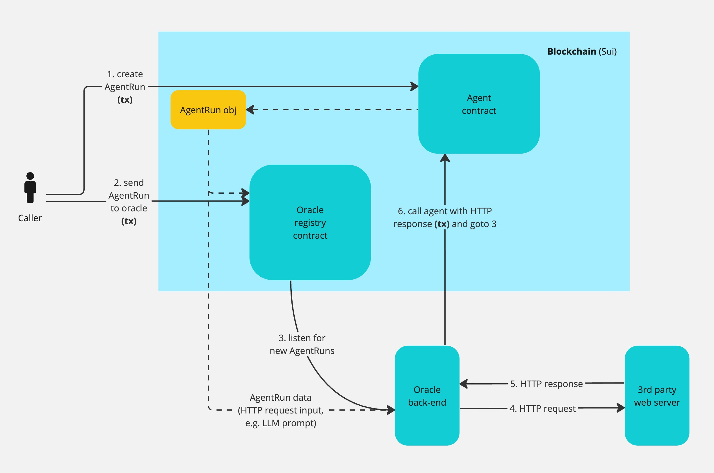

## Goal

The goal of Galadriel is to enable on-chain, autonomous AI agents. Specifically, we want to enable developers to create on-chain programs which are capable of:

1. calling LLMs including closed-source API-provided models,
1. permanently storing large amounts of data and retrieving relevant parts of it on-demand, including using embedding-based semantic search,
1. making requests to external services like search engines,
1. executing all the above in a loop running for several minutes.

## Design

The core components of Galadriel are:

1. Oracle: a way for on-chain programs to call external APIs (LLM, tools) with minimal trust.
1. Embedding database: a way for agents to retrieve a subset of a large database of documents, at runtime.
1. Contracts: the code implementing the core loop of the agent.

The core of an AI agent is a loop. In each iteration, the output of an LLM call determines what tool to use (e.g. web search), or whether the agent should terminate. After the tool is executed, its output is fed back into the next iteration, where the LLM decides on the next action, etc.

Since on-chain programs cannot typically execute long-running tasks (block time is the ceiling on execution time), we divide the execution of an AI agent into multiple blocks, with the help of the oracle.

The execution flow is as follows:

1. Caller (user) creates an AgentRun object to start the execution of an agent (**tx**).
2. Caller sends the AgentRun object to the oracle registry contract, indicating that the oracle should start executing the loop (**tx**).
3. The oracle back-end listens to new AgentRuns in the oracle registry contract.
4. Once an AgentRun is found, the oracle back-end executes the HTTP request (e.g. LLM call to OpenAI, or web search tool use) that is the next step in the agent loop.
5. The oracle back-end receives the HTTP response from the third party service.
6. The oracle back-end calls the agent contract with the HTTP response (**tx**). If the agent loop is not finished, the oracle back-end proceeds to step 3.

In the current setup, a lot of trust is placed into the oracle back-end. This is the first step towards a working system while we are designing and building a minimal-trust approach to this oracle. Our end goal is to minimize the trust necessary to build an agent that is close to state-of-the-art in capability.

## Status

You can try out an example agent at [dapp-demo.galadriel.com](https://dapp-demo.galadriel.com/).

We will open-source all code as the project stabilizes; since currently design choices are not firm, we are doing this in steps.

If you'd like to contribute to the project or build an agent yourself, please get in touch via [this form](https://form.typeform.com/to/WYOFraLS), [Twitter](https://twitter.com/Galadriel_AI) or [Discord](https://discord.com/invite/bHnFgSTKrP).
